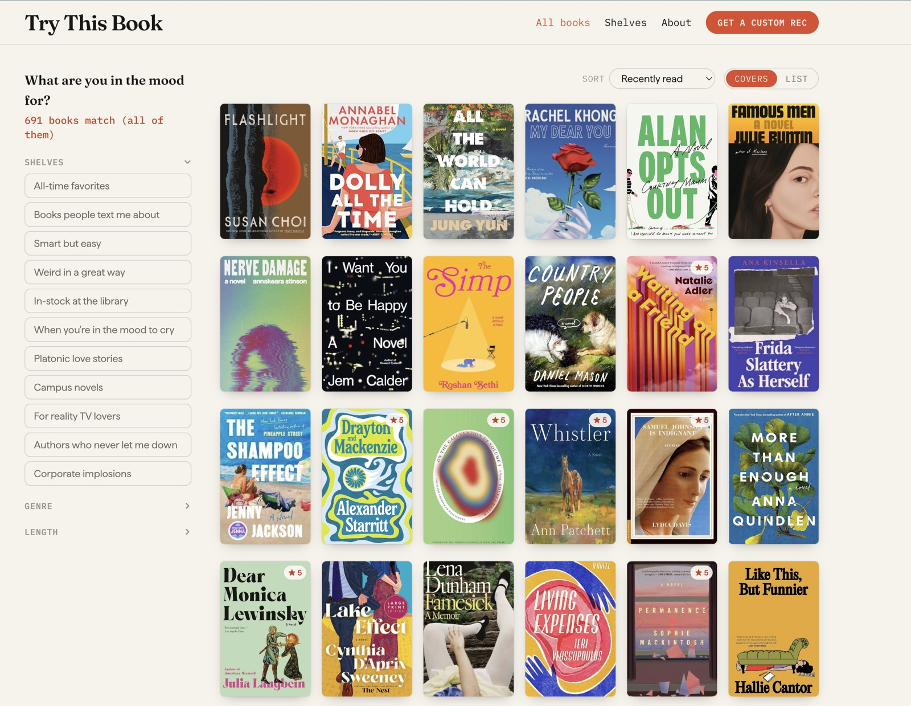

# Try This Book

**I read 120+ books a year and review the ones I rated 4 or 5 stars for Try This Book.**

[](LICENSE) [](https://trythisbook.com) 



There are currently ~700 books. Filter by mood, genre, or length, or describe exactly what you're looking for and get a custom recommendation.

## What's on it

| Page | What's there |
|---|---|
| **Home** | Every book I've loved in the last decade. Filter by shelf, genre, and length; sort by date or title; flip between covers and a list. |
| **Book page** | My short review, plus three related suggestions. |
| **Shelves** | Hand-picked collections — "Books people text me about," "When you're in the mood to cry." |
| **Ask** | Tell it what you're in the mood for and it pulls something from my shelves. |

## Make your own

It's built to run on your own Goodreads library. You'll need [Node.js](https://nodejs.org).

1. **Export your Goodreads books.** On Goodreads: *My Books → Import and Export → Export Library.* Save the file as `goodreads_export.csv` in the project folder.
2. **Build and run:**

```bash
npm install
cp .env.example .env.local   # optional — see below
npm run data                 # turns your CSV into the site's data
npm run covers               # optional — grabs book cover images
npm run dev                  # http://localhost:3000
```

That's all you need. But if you want to get fancy…

### Optional settings (`.env.local`)

| Setting | What it turns on |
|---|---|
| `ANTHROPIC_API_KEY` | The **Ask** page, where Claude picks a book for you. If you don't add an API key, it'll default to random books you've rated 4 or 5 stars (like Google's "Surprise Me"). |
| `GOODREADS_RSS_URL` | Auto-adding new 4- and 5-star books once a day. Get it from the RSS icon at the bottom of your Goodreads "read" shelf. |
| `ADMIN_PASSWORD` + `GITHUB_TOKEN` | A private `/admin` page for editing your reviews from the browser. |
| `CRON_SECRET` | Protects the `/api/sync` refresh hook. Fine to skip. |

## How it stays up-to-date

Your books live in two files, both checked in:

- **`data/library.json`** — built from your CSV. Don't hand-edit it; rerun `npm run data`.
- **`data/curation.json`** — your shelves and one-line reviews. This one you can edit by hand.

A GitHub Action checks your Goodreads feed once a day and adds any new 4- or 5-star book, then redeploys. It only ever adds; it won't touch your shelves or your reviews.

## Deploy

Built for [Vercel](https://vercel.com): import the repo, add any optional settings, point your domain at it. Every push to `main` (including the daily auto-add) redeploys on its own.

## Built with

Next.js (App Router), TypeScript, and Tailwind.

## License

MIT — take it, fork it, make it yours. 🙂 See [LICENSE](LICENSE).
